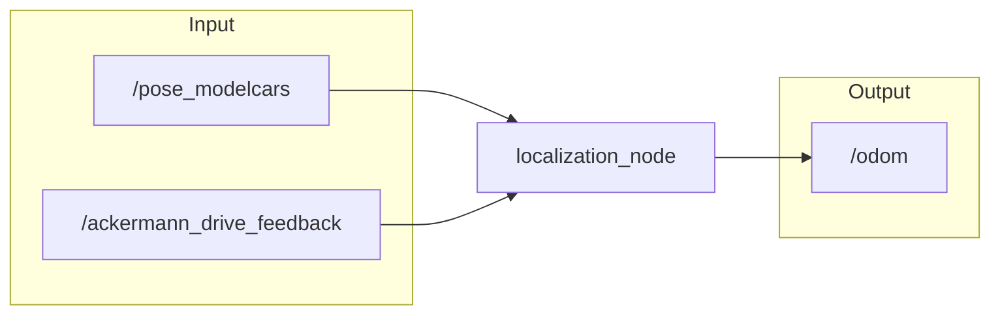
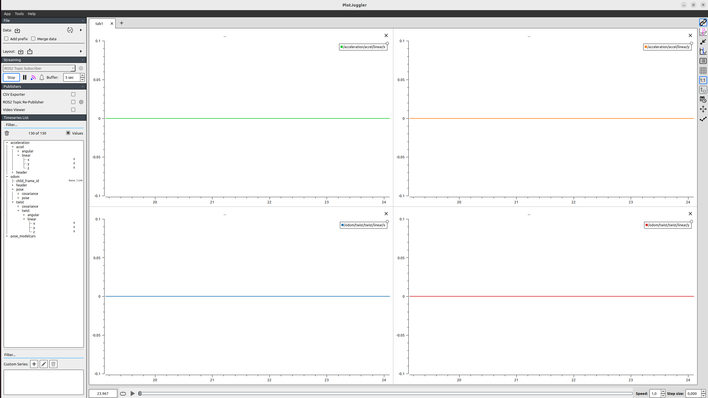
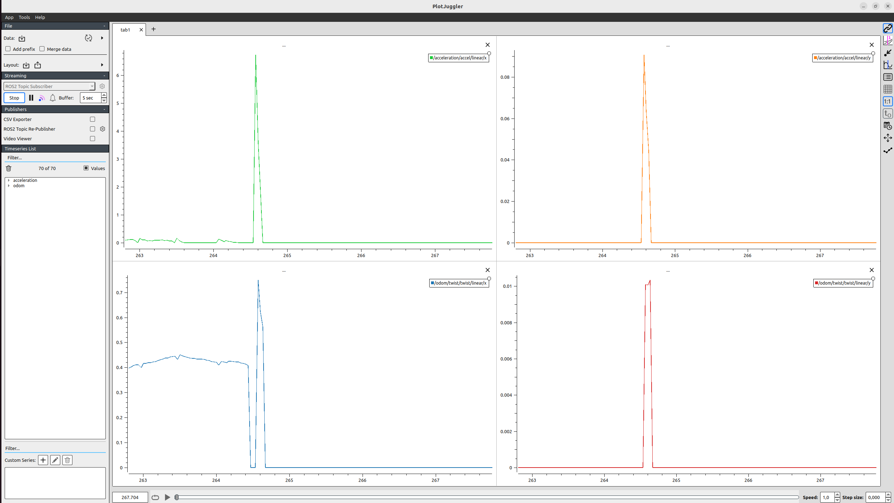
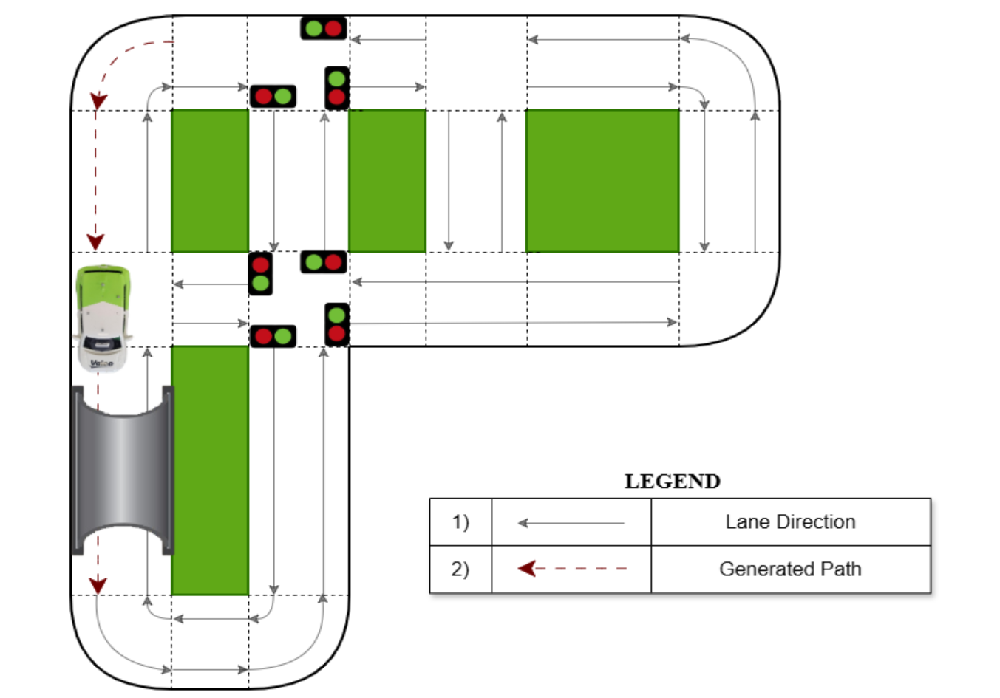

<div align="center">
  <h1>Localization</h1>
  <p><b>ROS2-based Hybrid Localization using Linear Kalman Filter and Dead Reckoning</b></p>
</div>
 
---
 
##  Overview
 
This repository contains a ROS2-based localization component developed for an autonomous shuttle.
 
The node estimates the vehicle’s pose by fusing motion capture data (OptiTrack) with wheel odometry using a **Linear Kalman Filter**. The system ensures continuous and stable localization even during temporary external positioning dropouts (e.g., tunnel scenarios).
 
The estimated state is published as a standard ROS2 odometry message and can be used for navigation, path planning, control, and visualization.
 
---
 
##  System Description
 
The `localization_node` acts as the central state estimation module of the vehicle.
 
### Responsibilities:
 
- Subscribes to `/pose_modelcars` (motion capture data)
- Identifies and extracts the ego vehicle’s pose
- Estimates velocity, acceleration, and yaw rate using a Linear Kalman Filter
- Subscribes to `/ackermann_drive_feedback` for wheel speed
- Switches to dead-reckoning mode when OptiTrack data is unavailable
- Publishes fused odometry to `/odom`
 
The node provides continuous pose estimation and prevents large discontinuities during sensor recovery.
 
---
 
##  Key Features
 
### 1️) Hybrid Sensor Fusion
- Fusion of OptiTrack pose and wheel odometry
- Linear Kalman Filter-based state estimation
- Smooth drift correction after sensor recovery
 
### 2️) Dead Reckoning Mode
When external positioning is temporarily unavailable:
- Uses last valid pose
- Propagates vehicle motion using wheel encoder speed
- Runs Kalman Filter in prediction-only mode
- Avoids pose jumps when external data returns
 
### 3️) Robust Fail-Safe Behavior
If no valid pose is available:
- Vehicle motion is safely prevented
- System automatically resumes normal operation once localization is initialized
 
---
 
##  System Architecture
 

 
---
 
##  Interfaces
 
| Topic | Type | Direction | Description |
|-------|------|-----------|-------------|
| `/pose_modelcars` | `mocap4r2_msgs/msg/RigidBodies` | Input | Motion capture pose data |
| `/ackermann_drive_feedback` | `ackermann_msgs/msg/AckermannDrive` | Input | Vehicle speed feedback |
| `/odom` | `nav_msgs/msg/Odometry` | Output | Estimated vehicle pose and velocity |
 
---
 
##  Evaluation
 
The localization system was validated using scenario-based testing:
 
###  Tunnel Traversal (No OptiTrack)
- Continuous pose output
- Stable motion
- Expected drift only
 
###  Stop & Restart in Tunnel
- No pose discontinuity
- Stable dead-reckoning behavior
 
###  Edge Case: Initialization Without External Pose
- Motion blocked until valid localization state available
- Seamless recovery after sensor availability
 
All defined performance indicators were successfully met.
 
---

---

##  State Estimation Validation (PlotJuggler)

State estimation performance was analyzed using **PlotJuggler** by visualizing the estimated states under two operating conditions:

- **Ideal State** (External positioning available)
- **Moving State / Dead-Reckoning Mode**

The plots below demonstrate system stability, smooth state propagation, and controlled drift behavior.

---

###  Velocity Estimation (Twist)

#### Ideal State

<p align="center">
  
</p>

#### Moving State

<p align="center">
  
</p>

**Observation:**
- Smooth velocity tracking
- No abrupt jumps during transitions
- Kalman Filter effectively reduces measurement noise

---

###  Yaw Rate Estimation

#### Ideal State

<p align="center">
  
</p>

#### Moving State

<p align="center">
  
</p>

**Observation:**
- Stable angular velocity estimation
- Bounded drift during external positioning loss
- Seamless recovery after sensor reinitialization

---

###  Pose Estimation (Position & Orientation)

#### Ideal State

<p align="center">
  
</p>

#### Moving State

<p align="center">
  
</p>

**Observation:**
- Continuous pose estimation during motion
- Controlled drift under dead-reckoning
- No large discontinuities after external positioning resumes

---

###  Summary

The PlotJuggler visualizations confirm that:

- The Linear Kalman Filter provides smooth and stable state estimates  
- Dead-reckoning maintains continuous localization during OptiTrack dropouts  
- Drift remains gradual and correctable  
- System transitions between fused and prediction-only modes are seamless  

These results validate the robustness of the hybrid localization approach.
 
##  Installation
 
### 1️) Create ROS2 workspace
 
```bash
mkdir -p loc_ws/src
cd loc_ws/src
```
 
### 2️) Clone repositories
 
```bash
git clone https://github.com/YashashwiGowda/localization.git 
git clone https://github.com/MOCAP4ROS2-Project/mocap4r2_msgs.git
```
 
### 3️) Build
 
```bash
cd ..
colcon build
```
 
### 4️) Source
 
```bash
source install/setup.bash
```
 
---
 
##  Usage
 
Run the localization node:
 
```bash
ros2 run localization localization_node
```
 
---
 
##  Testing & Code Quality
 
### Unit Tests with Coverage
 
```bash
python3 -m coverage run --branch --source=localization_node_under_test -m pytest -v src/localization/test/test_localization.py
python3 -m coverage report -m
python3 -m coverage html
```
 
### Static Code Analysis
 
```bash
pylint src/localization/localization/localization_node.py
```
 
### Code Complexity Analysis
 
```bash
lizard src/localization/localization/localization_node.py
```
 
---
 
##  Example Scenario
 
<p align="center">
  
  
</p>
 
---
 
##  Technologies Used
 
- ROS2
- Python
- Linear Kalman Filter
- OptiTrack (Motion Capture System)
- Wheel Odometry
- RViz2
- PlotJuggler
 
---
 
##  Author
 
**Yashashwi R Gowda**  
M.Engg. Autonomous Driving  
Hochschule Coburg  
 
---
 

 
